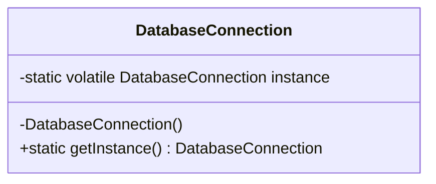
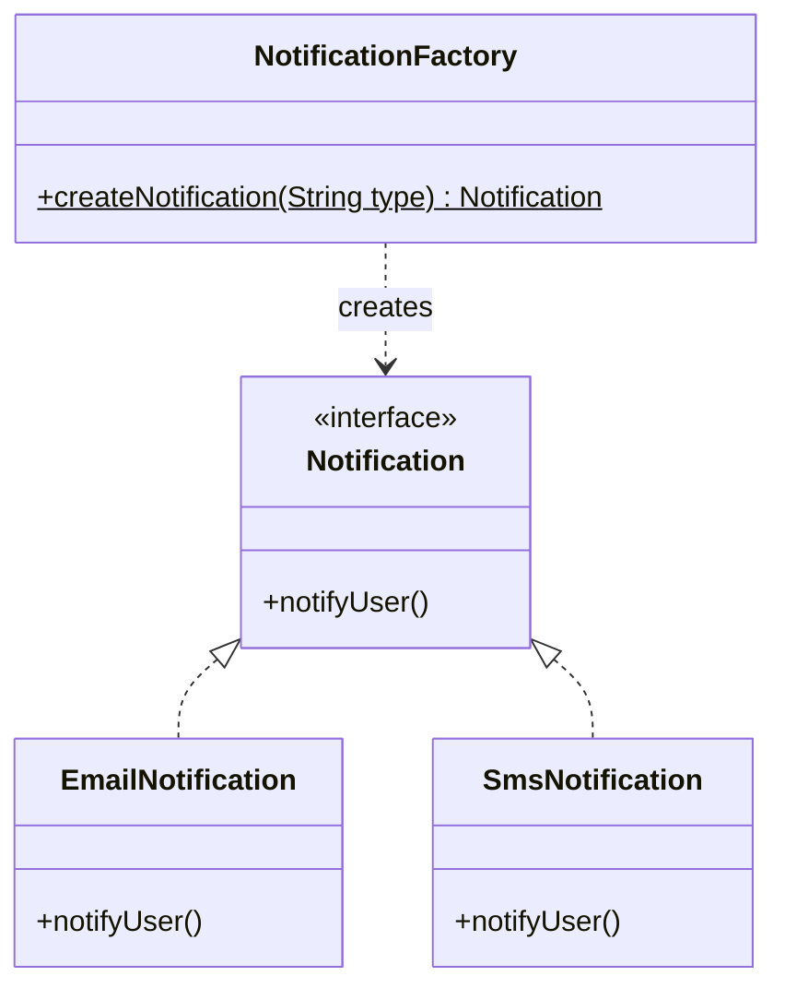

# Low-Level Design (LLD) Notes

## Creational Patterns

### 1. Singleton Pattern
**Intent:** Ensure a class has only one instance and provide a global point of access.

### 2. Factory Pattern
**Intent:** Provide an interface for creating objects in a superclass, but allow subclasses to alter the type of objects that will be created.

