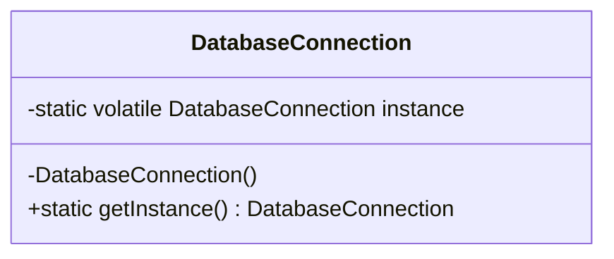
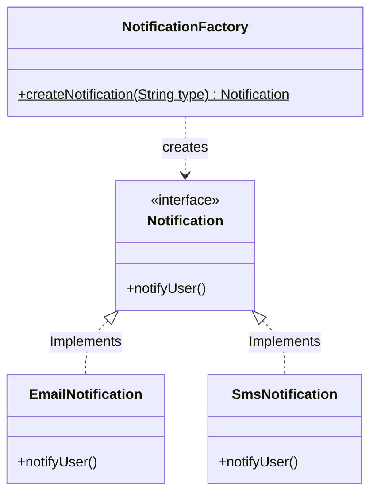
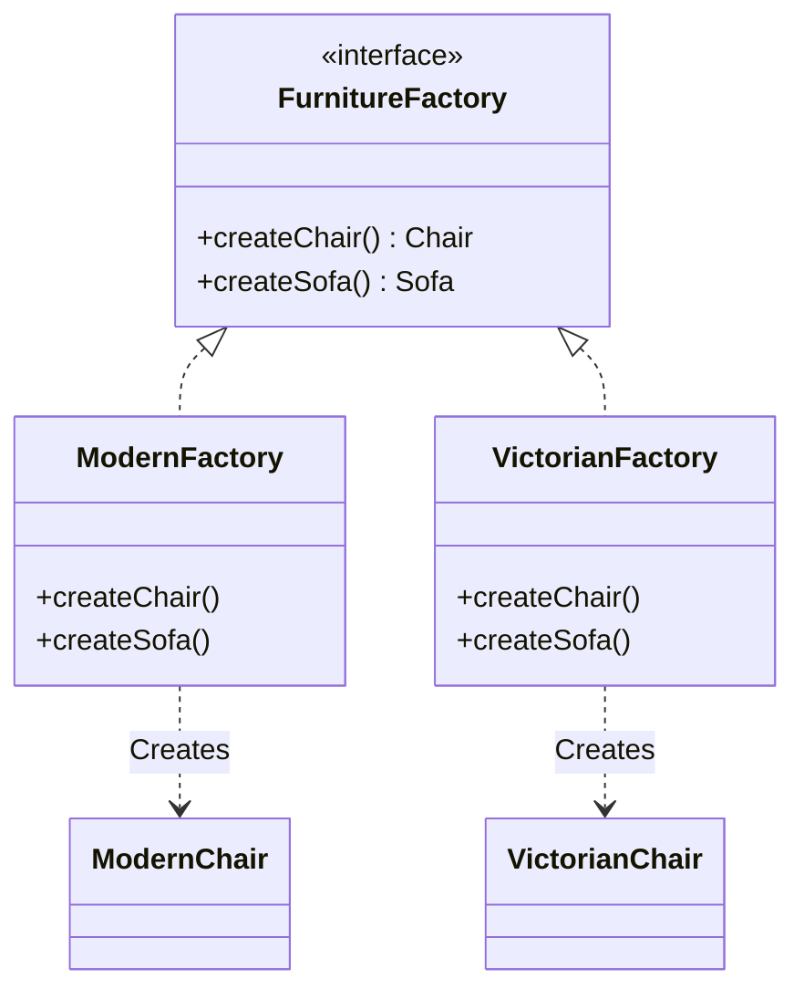
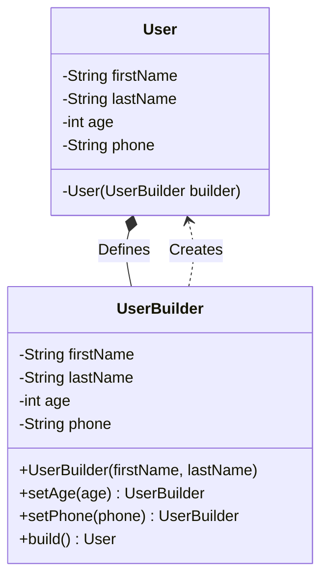
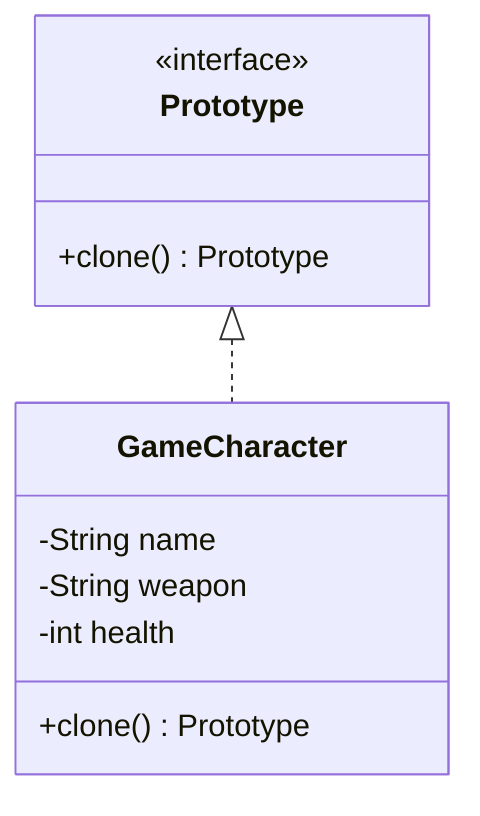
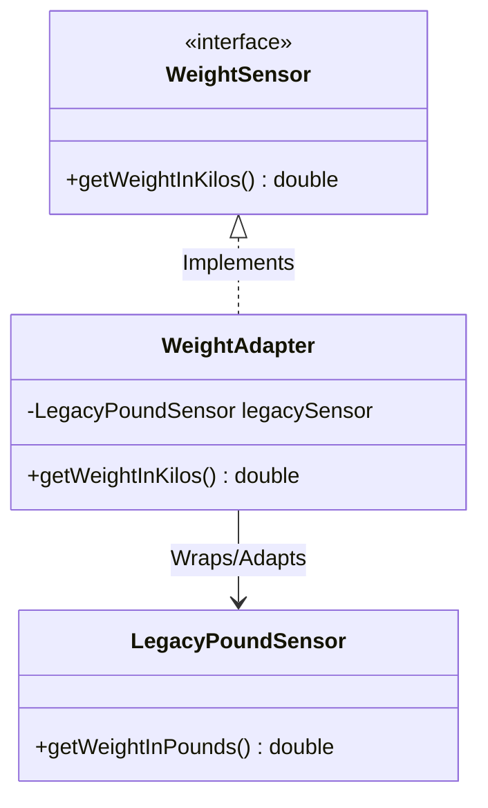
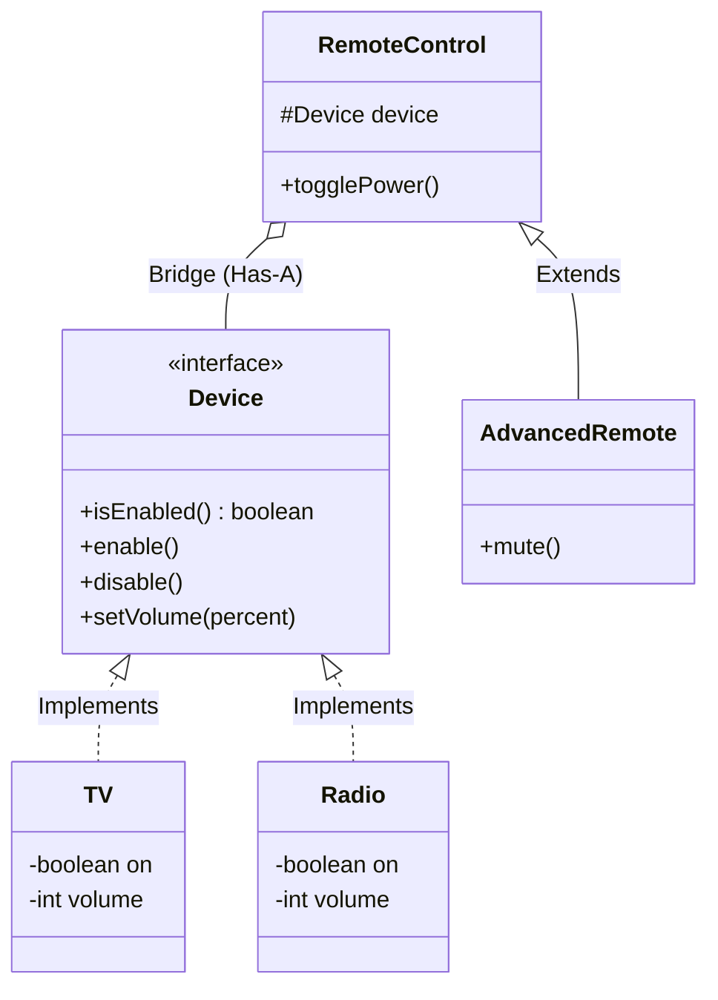

# Low-Level Design (LLD) Notes

## Creational Patterns

### 1. Singleton Pattern
**Intent:** Ensure a class has only one instance and provide a global point of access.

### 2. Factory Pattern
**Intent:** Provide an interface for creating objects in a superclass, but allow subclasses to alter the type of objects that will be created.

### 3. Absolute Factory Pattern

### 4. Builder Pattern

### 5. Prototype Pattern
**Intent:** It allows you to create a new object by cloning an existing prototype and modifying only what's necessary.

## Structural Patterns

### 1. Adapter Pattern
**Intent:** Convert the interface of a class into another interface clients expect.

### 2. Bridge Pattern
**Intent:** Decouple an abstraction from its implementation so that the two  can vary independently.

