# Low-Level Design (LLD) Notes

## Creational Patterns

### 1. Singleton Pattern
**Intent:** Ensure a class has only one instance and provide a global point of access.

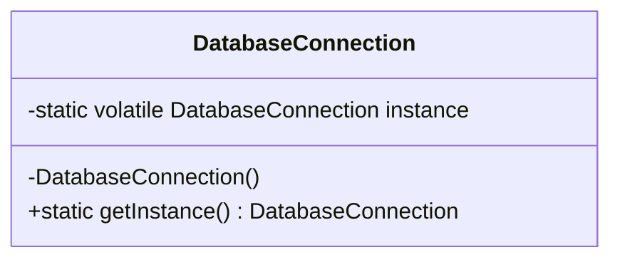
```mermaid
classDiagram
    class DatabaseConnection {
        -static volatile DatabaseConnection instance
        -DatabaseConnection()
        +static getInstance() DatabaseConnection
    }
```
### 2. Factory Pattern
**Intent:** Provide an interface for creating objects in a superclass, but allow subclasses to alter the type of objects that will be created.

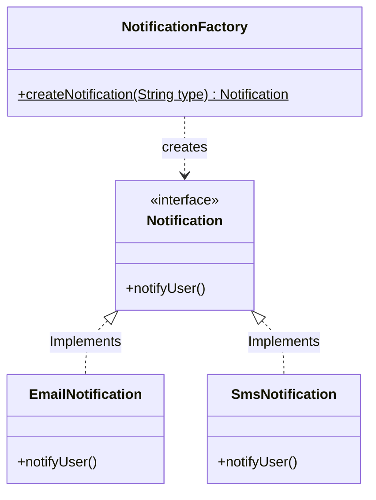
```mermaid
classDiagram
    class Notification {
        <<interface>>
        +notifyUser()
    }
    class EmailNotification {
        +notifyUser()
    }
    class SmsNotification {
        +notifyUser()
    }
    class NotificationFactory {
        +createNotification(String type) Notification$
    }
    Notification <|.. EmailNotification : Implements
    Notification <|.. SmsNotification : Implements
    NotificationFactory ..> Notification : creates
```
### 3. Absolute Factory Pattern

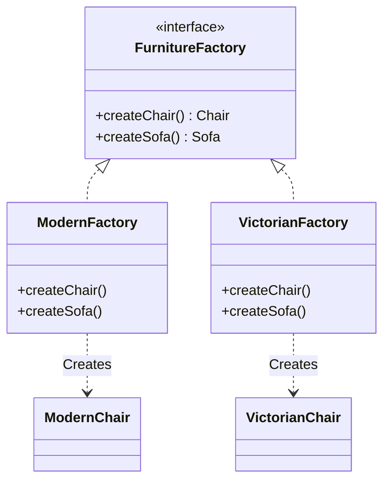
```mermaid
classDiagram
    class FurnitureFactory {
        <<interface>>
        +createChair() Chair
        +createSofa() Sofa
    }
    class ModernFactory {
        +createChair()
        +createSofa()
    }
    class VictorianFactory {
        +createChair()
        +createSofa()
    }
    
    FurnitureFactory <|.. ModernFactory
    FurnitureFactory <|.. VictorianFactory
    ModernFactory ..> ModernChair : Creates
    VictorianFactory ..> VictorianChair : Creates
```

### 4. Builder Pattern

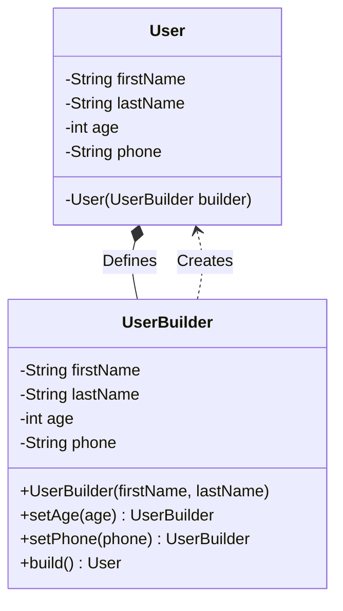
```mermaid
classDiagram
    class User {
        -String firstName
        -String lastName
        -int age
        -String phone
        -User(UserBuilder builder)
    }
    class UserBuilder {
        -String firstName
        -String lastName
        -int age
        -String phone
        +UserBuilder(firstName, lastName)
        +setAge(age) UserBuilder
        +setPhone(phone) UserBuilder
        +build() User
    }
    %% Use *-- for nested/inner class relationship
    User *-- UserBuilder : Defines
    UserBuilder ..> User : Creates
```

### 5. Prototype Pattern
**Intent:** It allows you to create a new object by cloning an existing prototype and modifying only what's necessary.

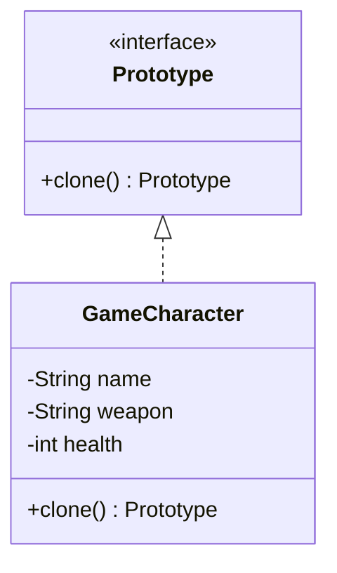
```mermaid
classDiagram
    class Prototype {
        <<interface>>
        +clone() Prototype
    }
    class GameCharacter {
        -String name
        -String weapon
        -int health
        +clone() Prototype
    }
    Prototype <|.. GameCharacter
```

## Structural Patterns

### 1. Adapter Pattern
**Intent:** Convert the interface of a class into another interface clients expect.

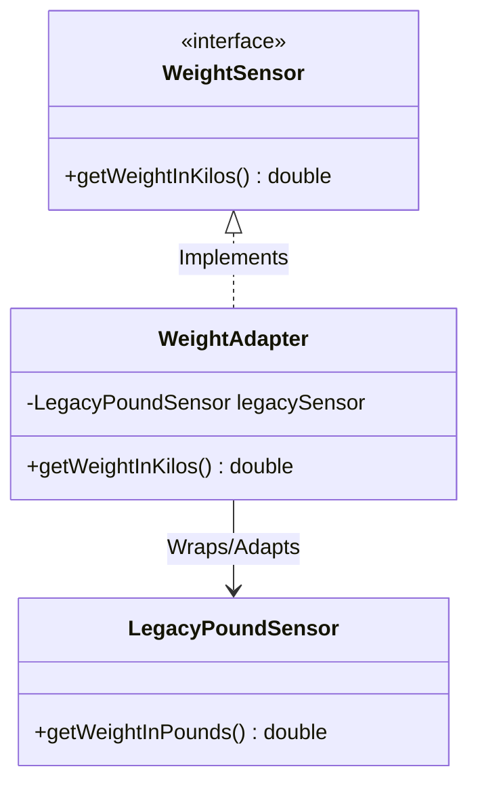
```mermaid
classDiagram
    class WeightSensor {
        <<interface>>
        +getWeightInKilos() double
    }
    class LegacyPoundSensor {
        +getWeightInPounds() double
    }
    class WeightAdapter {
        -LegacyPoundSensor legacySensor
        +getWeightInKilos() double
    }

    WeightSensor <|.. WeightAdapter : Implements
    WeightAdapter --> LegacyPoundSensor : Wraps/Adapts
```

### 2. Bridge Pattern
**Intent:** Decouple an abstraction from its implementation so that the two  can vary independently.

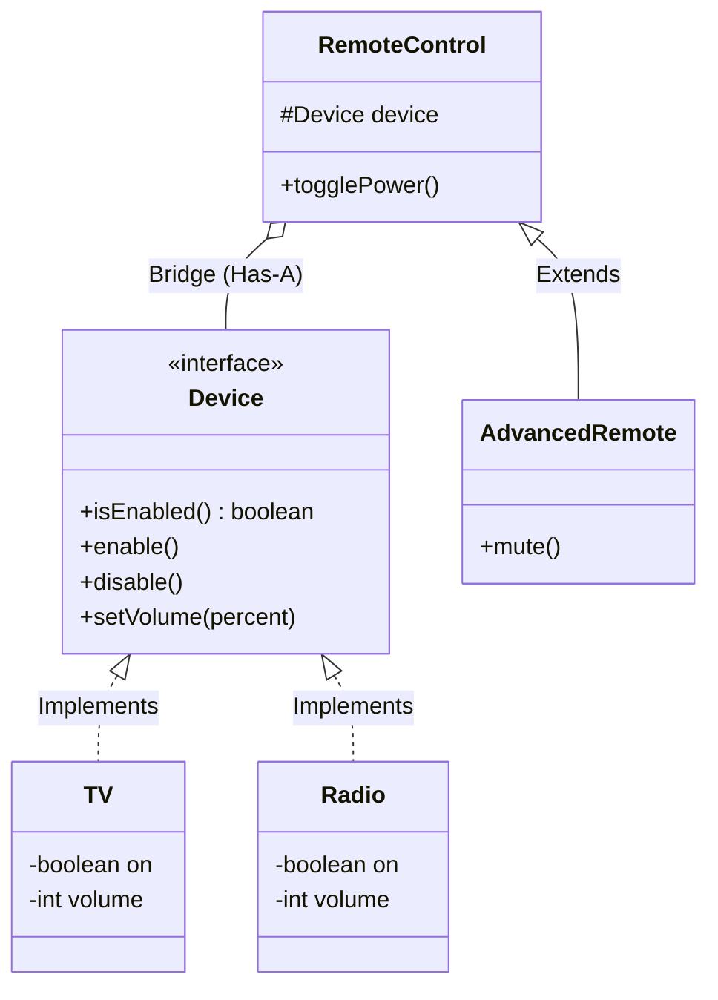
```mermaid
classDiagram
    class Device {
        <<interface>>
        +isEnabled() boolean
        +enable()
        +disable()
        +setVolume(percent)
    }
    class TV {
        -boolean on
        -int volume
    }
    class Radio {
        -boolean on
        -int volume
    }

    class RemoteControl {
        #Device device
        +togglePower()
    }
    class AdvancedRemote {
        +mute()
    }

    Device <|.. TV : Implements
    Device <|.. Radio : Implements
    
    RemoteControl <|-- AdvancedRemote : Extends
    
    %% The Bridge (Composition)
    RemoteControl o-- Device : Bridge (Has-A)
```

### 3. Composite Pattern
**Intent:** Compose objects into tree structures to represent part-whole hierarchies. Lets clients treat individual objects and compositions uniformly.

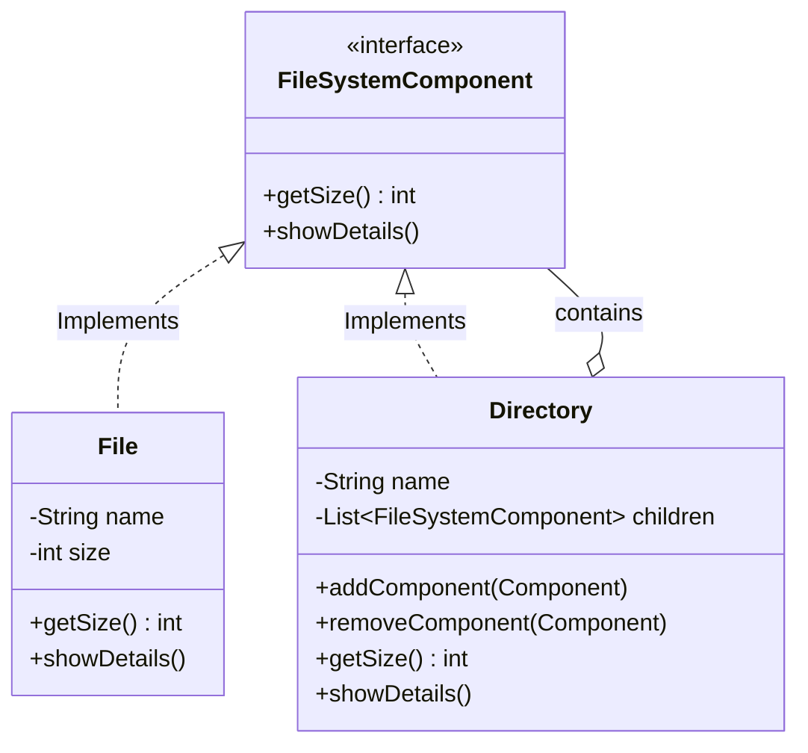
```mermaid
classDiagram
    class FileSystemComponent {
        <<interface>>
        +getSize() int
        +showDetails()
    }
    class File {
        -String name
        -int size
        +getSize() int
        +showDetails()
    }
    class Directory {
        -String name
        -List~FileSystemComponent~ children
        +addComponent(Component)
        +removeComponent(Component)
        +getSize() int
        +showDetails()
    }

    FileSystemComponent <|.. File : Implements
    FileSystemComponent <|.. Directory : Implements
    
    %% The Composite aggregation (Directory contains Components)
    Directory o-- FileSystemComponent : contains
```

### 4. Decorator Pattern
**Intent:** Attach additional responsibilities to an object dynamically. Decorators provide a flexible alternative to subclassing for extending functionality.

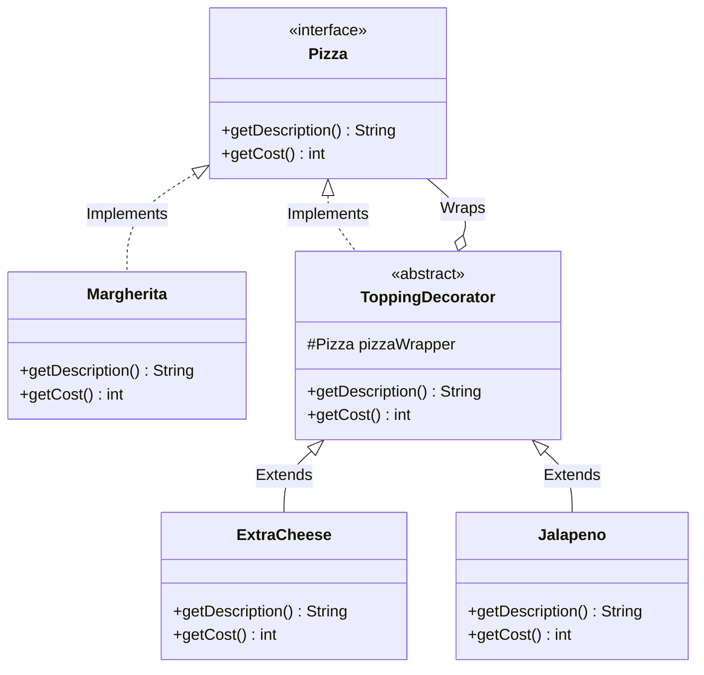
```mermaid
classDiagram
    class Pizza {
        <<interface>>
        +getDescription() String
        +getCost() int
    }
    class Margherita {
        +getDescription() String
        +getCost() int
    }
    class ToppingDecorator {
        <<abstract>>
        #Pizza pizzaWrapper
        +getDescription() String
        +getCost() int
    }
    class ExtraCheese {
        +getDescription() String
        +getCost() int
    }
    class Jalapeno {
        +getDescription() String
        +getCost() int
    }

    Pizza <|.. Margherita : Implements
    Pizza <|.. ToppingDecorator : Implements
    
    %% The Decorator both IS A Pizza and HAS A Pizza
    ToppingDecorator o-- Pizza : Wraps
    
    ToppingDecorator <|-- ExtraCheese : Extends
    ToppingDecorator <|-- Jalapeno : Extends
```

### 5. Facade Pattern
**Intent:** Provide a unified interface to a set of interfaces in a subsystem. Facade defines a higher-level interface that makes the subsystem easier to use.

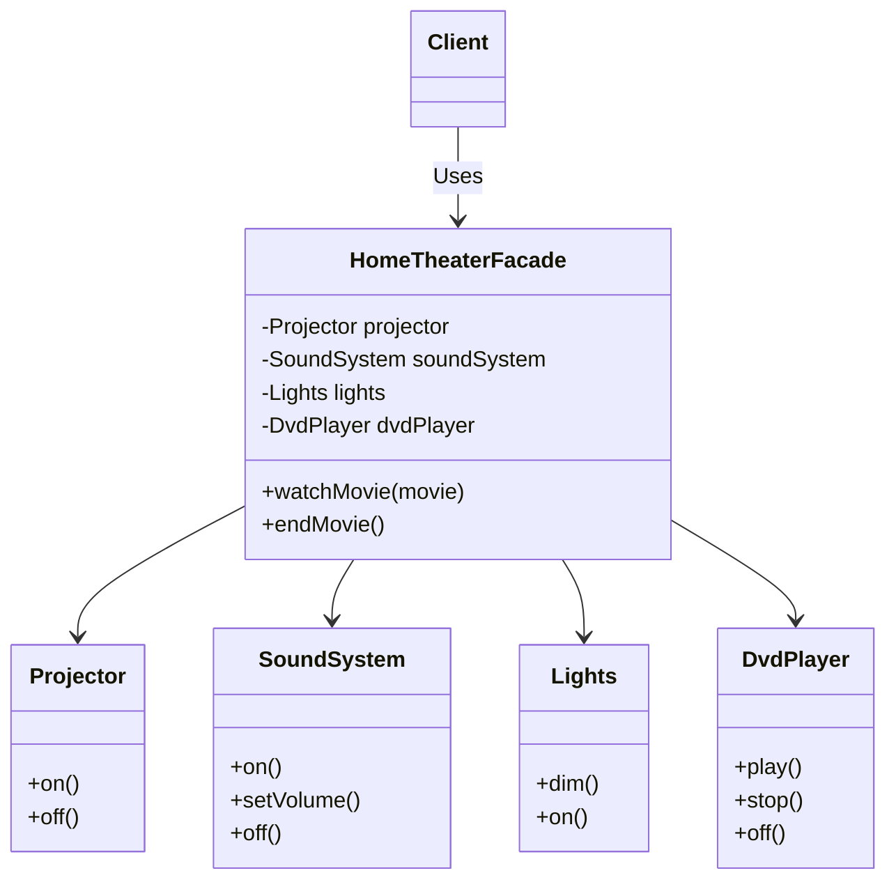
```mermaid
classDiagram
    class Client {
    }
    class HomeTheaterFacade {
        -Projector projector
        -SoundSystem soundSystem
        -Lights lights
        -DvdPlayer dvdPlayer
        +watchMovie(movie)
        +endMovie()
    }
    class Projector {
        +on()
        +off()
    }
    class SoundSystem {
        +on()
        +setVolume()
        +off()
    }
    class Lights {
        +dim()
        +on()
    }
    class DvdPlayer {
        +play()
        +stop()
        +off()
    }

    %% Client ONLY talks to the Facade
    Client --> HomeTheaterFacade : Uses
    
    %% Facade handles the complex subsystem
    HomeTheaterFacade --> Projector
    HomeTheaterFacade --> SoundSystem
    HomeTheaterFacade --> Lights
    HomeTheaterFacade --> DvdPlayer
```

### 6. Proxy Pattern
**Intent:** Provide a surrogate or placeholder for another object to control access to it.

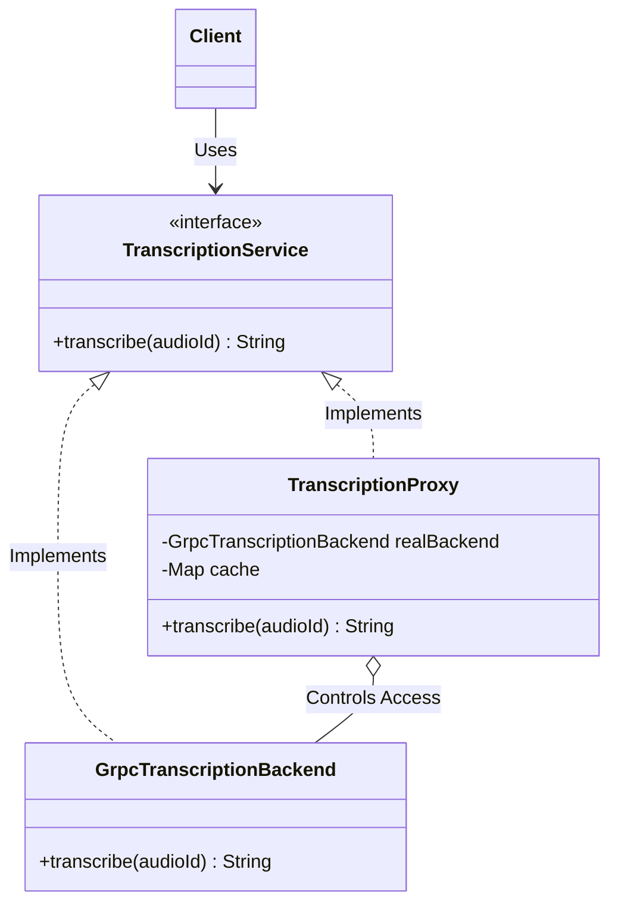
```mermaid
classDiagram
    class TranscriptionService {
        <<interface>>
        +transcribe(audioId) String
    }
    class GrpcTranscriptionBackend {
        +transcribe(audioId) String
    }
    class TranscriptionProxy {
        -GrpcTranscriptionBackend realBackend
        -Map cache
        +transcribe(audioId) String
    }
    class Client {
    }

    TranscriptionService <|.. GrpcTranscriptionBackend : Implements
    TranscriptionService <|.. TranscriptionProxy : Implements
    
    %% The Proxy holds a reference to the Real Subject
    TranscriptionProxy o-- GrpcTranscriptionBackend : Controls Access
    
    %% Client only talks to the interface
    Client --> TranscriptionService : Uses
```

### 7. Flyweight Pattern
**Intent:** Use sharing to support large numbers of fine-grained objects efficiently.

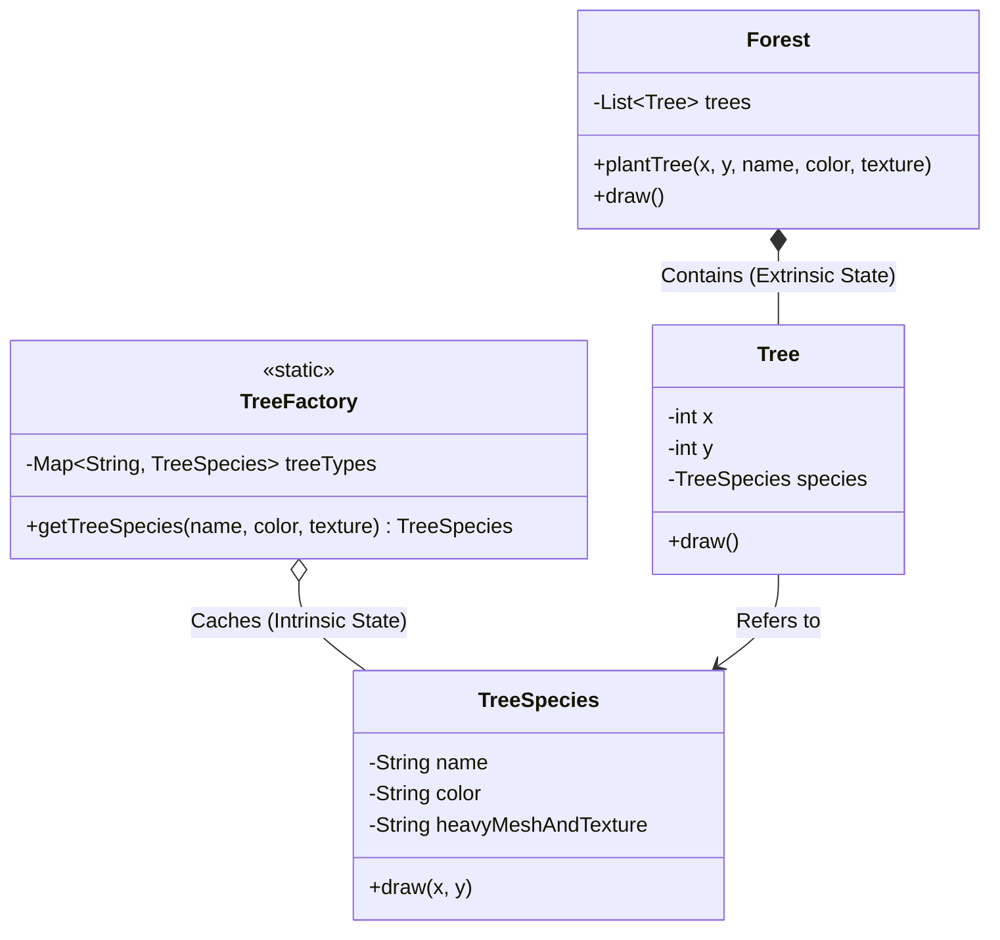
```mermaid
classDiagram
    class TreeFactory {
        <<static>>
        -Map~String, TreeSpecies~ treeTypes
        +getTreeSpecies(name, color, texture) TreeSpecies
    }
    class TreeSpecies {
        -String name
        -String color
        -String heavyMeshAndTexture
        +draw(x, y)
    }
    class Tree {
        -int x
        -int y
        -TreeSpecies species
        +draw()
    }
    class Forest {
        -List~Tree~ trees
        +plantTree(x, y, name, color, texture)
        +draw()
    }

    %% Relationships
    TreeFactory o-- TreeSpecies : Caches (Intrinsic State)
    Tree --> TreeSpecies : Refers to
    Forest *-- Tree : Contains (Extrinsic State)
```